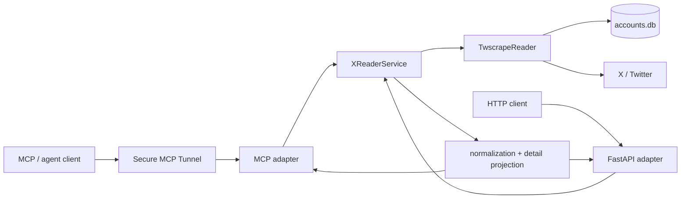

# x-reader

[](https://github.com/abocha/x-reader/actions/workflows/test.yml)

A small read-only X/Twitter reader built for tool-using LLM clients.

`x-reader` keeps upstream access, domain behavior, normalization, and transport adapters separate. The same service layer is exposed through MCP for agent/tool use and through a small FastAPI compatibility API. Production access is via a private Secure MCP Tunnel rather than a public HTTP ingress.

## What it does

- searches current public X/Twitter posts by text, author, or both;
- reads recent user timelines with optional replies, reposts, and account details;
- reads a single post with optional parent, author-thread, reply, or conversation context;
- normalizes unstable upstream objects into a smaller, predictable public shape;
- preserves large X post IDs as strings at MCP boundaries to avoid JavaScript precision loss;
- offers `minimal`, `compact`, and `full` post projections so LLM callers can trade metadata for payload size without causing extra upstream requests;
- keeps both MCP and HTTP surfaces read-only and rate-limited.

This is an independent project and is not affiliated with X Corp.

## Architecture



The core design rule is simple: adapters translate requests, while `XReaderService` owns filtering, ordering, deduplication, timeline semantics, and context behavior. Upstream access stays in `reader.py`; stable output shapes stay in `normalize.py`.

That separation matters here because the MCP surface evolved substantially without requiring a second implementation of the same behavior in the HTTP adapter.

## MCP surface

The current server exposes six read-only tools:

| Tool | Purpose |
| --- | --- |
| `search_x` | Search posts by query and/or author filters. |
| `read_x_user` | Read a user profile and recent timeline with optional replies, reposts, and account details. |
| `read_x_post` | Read one post plus optional parent/thread/replies/conversation context. |
| `get_x_user_posts` | Compatibility tool for recent original posts from one user. |
| `get_x_post` | Compatibility tool for one post by decimal string ID. |
| `get_x_thread` | Compatibility tool for an author's thread around a post. |

The richer tools accept three post detail levels:

| Detail | Intended use | Shape |
| --- | --- | --- |
| `minimal` | broad discovery / larger result sets | core identity, text, author handle, and only context fields that add information |
| `compact` | structured exploration | stable IDs, author identity, reply/repost/quote state, conversation provenance |
| `full` | focused drill-down | compact fields plus metrics, media, links, mentions, hashtags, sensitivity, and cards |

`search_x` and `read_x_user` default to `minimal`; `read_x_post` defaults to `full`. The older compatibility tools preserve their existing full response shape.

## HTTP compatibility API

The FastAPI adapter remains useful for local development and compatibility, but it is not the supported production ingress.

| Route | Purpose |
| --- | --- |
| `GET /health` | process health |
| `GET /v1/search` | search posts |
| `GET /v1/users/{username}/posts` | recent user posts |
| `GET /v1/tweets/{tweet_id}` | one post |
| `GET /v1/tweets/{tweet_id}/thread` | author's thread |

## Quick start

### Requirements

- Python 3.12+
- [uv](https://docs.astral.sh/uv/)
- a twscrape-compatible `accounts.db`

Credential/account provisioning is intentionally outside this repository. The account database may contain sensitive authentication material and is gitignored.

Install the locked environment:

```bash
uv sync --frozen
```

Point x-reader at the account database:

```bash
export X_READER_DB_PATH=/absolute/path/to/accounts.db
```

Start the MCP server over stdio:

```bash
uv run x-reader-mcp
```

For local HTTP development:

```bash
uv run uvicorn x_reader.app:app --host 127.0.0.1 --port 8789
```

Do not expose that development command directly to the public internet without adding an appropriate authentication and proxy boundary.

## Development

The repository uses `uv` for dependency management and runs three checks in CI on pull requests and pushes to `main`:

```bash
uv run pytest
uv run ruff check .
uv run ty check .
```

The test suite is fixture-driven and does not require live X access.

### Repository layout

```text
src/x_reader/
  reader.py       # twscrape/upstream access
  service.py      # use-case behavior and timeline semantics
  normalize.py    # stable public representations and detail projections
  mcp_server.py   # MCP adapter and tool schemas
  app.py          # FastAPI compatibility adapter
  locators.py     # user/post locator parsing and validation
  filters.py      # shared filtering, ordering, and classification helpers
  rate_limit.py   # in-process sliding-window limiter

tests/            # behavior, compatibility, regression, and smoke-readiness tests
docs/             # deployment/runbook documentation
```

## Deployment

The supported production path is:

```text
ChatGPT / MCP client
  -> OpenAI Secure MCP Tunnel
  -> tunnel-client
  -> x-reader-mcp over stdio
  -> TwscrapeReader
  -> X/Twitter
```

There is no public production FastAPI/Caddy ingress for x-reader. See [the Secure MCP Tunnel runbook](docs/secure-mcp-tunnel-runbook.md) for the deployment and operational details.

## Engineering notes

A few constraints shaped the implementation:

- **Stable IDs at tool boundaries.** X post IDs exceed JavaScript's safe integer range, so MCP schemas require decimal strings where precision matters.
- **One behavioral core.** MCP and HTTP adapters reuse the same service instead of duplicating filtering or context logic.
- **Projection without refetching.** `minimal`, `compact`, and `full` are output projections over the same fetched records, not different retrieval paths.
- **Compatibility is explicit.** Older HTTP routes and MCP tools are kept as compatibility surfaces while richer read tools evolve.
- **Private production ingress.** The service runs behind a secure tunnel and stdio MCP boundary rather than exposing its HTTP adapter publicly.

## Security

Secrets, session databases, and runtime keys do not belong in the repository. `accounts.db` and `.env` are ignored by Git.

For vulnerability reporting and the project's security assumptions, see [SECURITY.md](SECURITY.md).
